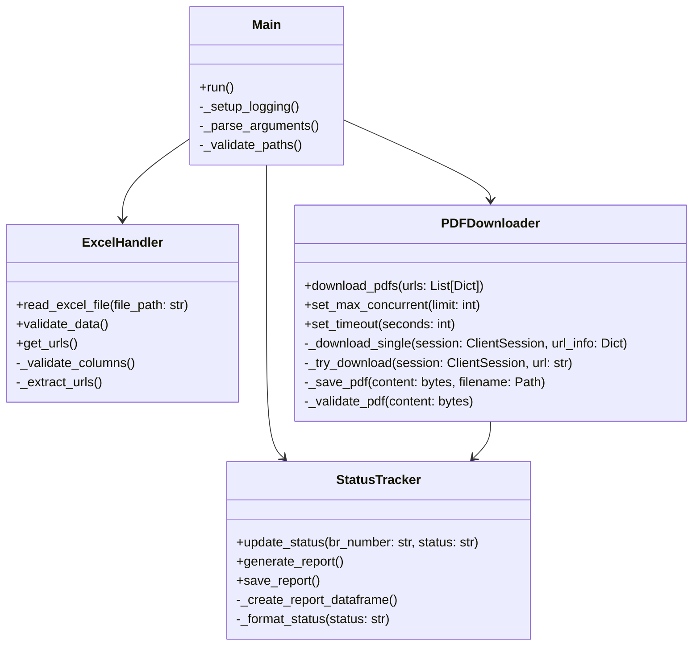

# UML Klasse Diagram

## Klassernes Ansvar

### ExcelHandler
- Håndterer læsning og validering af Excel-filer
- Ekstraherer URLs og metadata
- Validerer data format og kolonner

### PDFDownloader
- Håndterer asynkron nedlasting af PDF-filer
- Implementerer retry logik og fejlhåndtering
- Validerer PDF indhold
- Håndterer concurrent downloads

### StatusTracker
- Registrerer download status
- Genererer og gemmer status rapporter
- Formaterer status data

### Main
- Koordinerer program flow
- Håndterer argument parsing
- Sætter op logging
- Validerer input/output paths
