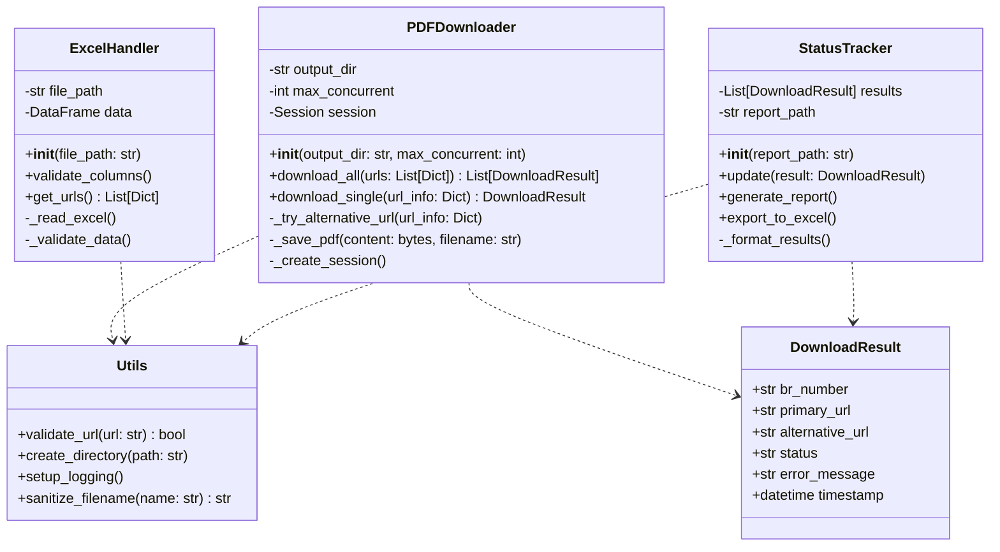

# UML Class Diagram - PDF Downloader

Dette diagram viser:

1. **ExcelHandler**
   - Håndterer læsning og validering af Excel filer
   - Ekstraherer URL information
   - Validerer nødvendige kolonner

2. **PDFDownloader**
   - Håndterer concurrent downloads
   - Implementerer fallback til alternative URLs
   - Gemmer PDFs med korrekt navngivning

3. **StatusTracker**
   - Holder styr på download status
   - Genererer statusrapporter
   - Eksporterer resultater til Excel

4. **DownloadResult**
   - Data klasse til at holde information om hver download
   - Inkluderer status, fejlbeskeder og timestamps

5. **Utils**
   - Hjælpefunktioner der bruges på tværs af klasserne
   - URL validering, filhåndtering, logging

**Relationer:**
- PDFDownloader og StatusTracker bruger DownloadResult til at kommunikere resultater
- Alle klasser bruger Utils for fælles funktionalitet
- ExcelHandler leverer data til PDFDownloader
- StatusTracker modtager resultater fra PDFDownloader
